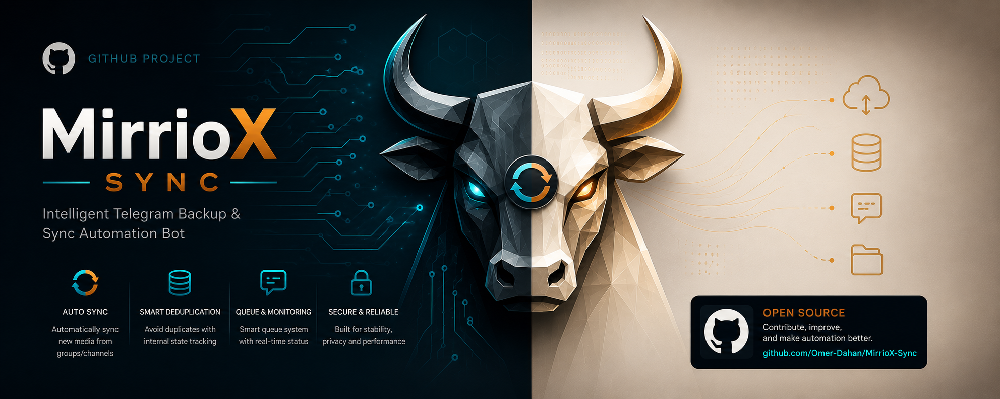
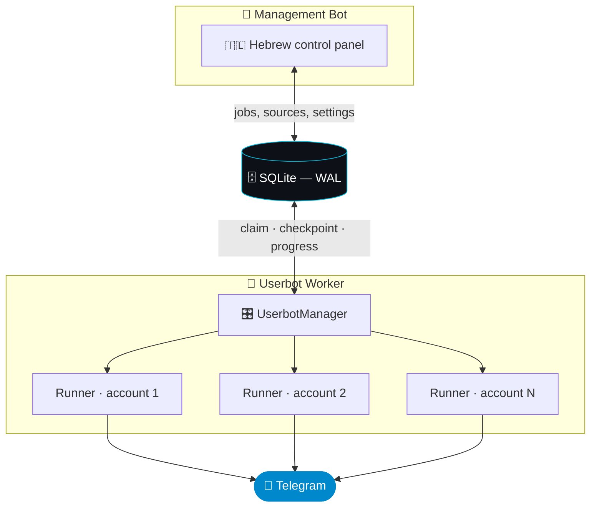
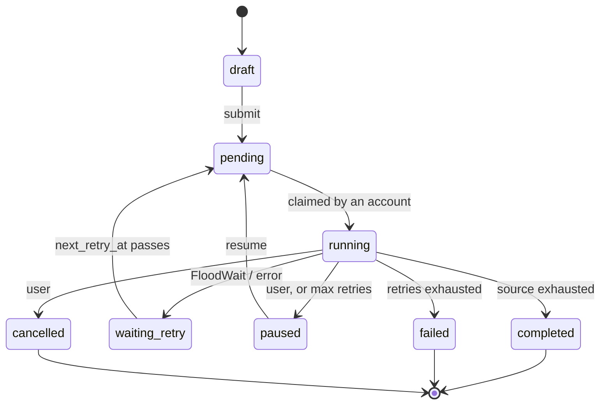
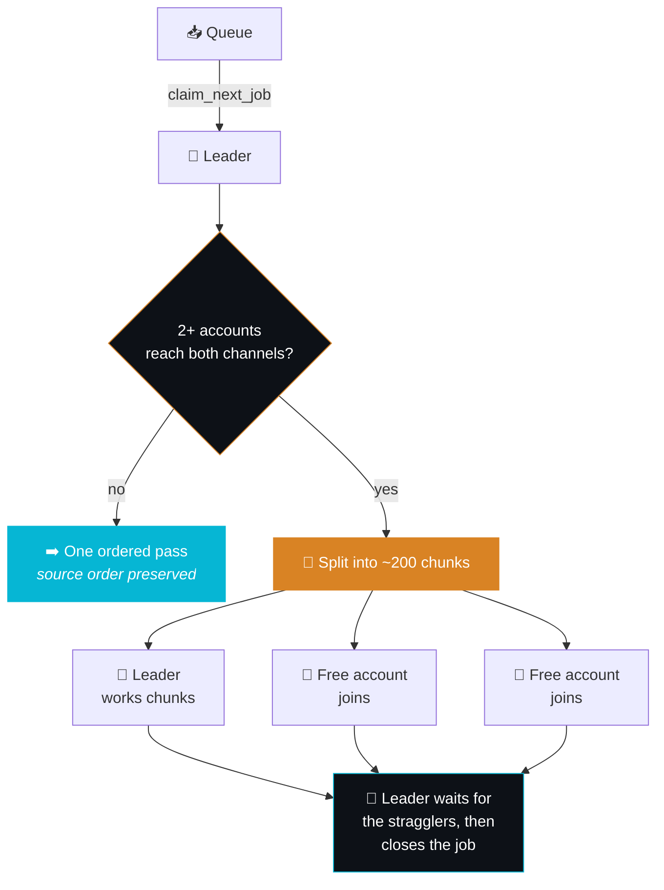

<div align="center">



<br>

### Intelligent Telegram Backup &amp; Sync Automation

**Copy entire Telegram channels — history, albums, media and all — across as many userbot accounts as you own.**<br>
Hebrew management bot. Crash-proof checkpoints. Real parallelism.

<br>

<a href="#-quick-start"></a>
<a href="#-multi-account--parallel-copying"></a>
<a href="#-architecture"></a>

<br><br>


</div>

---

## 📑 Table of Contents

<table>
<tr>
<td valign="top">

**Getting started**
- [✨ Features](#-features)
- [🧠 Architecture](#-architecture)
- [🚀 Quick Start](#-quick-start)
- [🎮 Usage](#-usage)

</td>
<td valign="top">

**Copying**
- [📋 Copy Modes](#-copy-modes)
- [🤖 Multi-Account &amp; Parallel Copying](#-multi-account--parallel-copying)
- [📦 Content Types](#-content-types)
- [🔒 Blocked Words](#-blocked-words)

</td>
<td valign="top">

**Operations**
- [🚑 Restart Recovery](#-restart-recovery)
- [🧱 Project Structure](#-project-structure)
- [🚦 Safety Defaults](#-safety-defaults)

</td>
</tr>
</table>

---

## ✨ Features

<table>
<tr>
<td width="33%" valign="top">

### 🤖 Truly parallel
One runner **per userbot account**, all copying at once — across jobs, and *inside* a single job once two accounts can reach its channels.

</td>
<td width="33%" valign="top">

### 🧩 Chunked & resumable
A job's ID range is split into ~200 chunks, each with **its own checkpoint**. Kill the process mid-copy; it resumes exactly where it stopped.

</td>
<td width="33%" valign="top">

### 🛟 Never copies twice
Every processed message ID is recorded. Stale checkpoints, crashes and reclaimed chunks can't produce a duplicate.

</td>
</tr>
<tr>
<td valign="top">

### 📅 Per-account quotas
Telegram limits are **per account**, so the daily cap is too. A spent account steps aside; the rest keep going at full speed.

</td>
<td valign="top">

### 🔐 Per-account access
One account may be in a channel while another isn't. Each probes for itself, and the UI reports exactly who can reach what.

</td>
<td valign="top">

### 🖼️ Albums & protected sources
Media groups stay grouped. "No forwarding" channels fall back to download-and-reupload automatically.

</td>
</tr>
<tr>
<td valign="top">

### 🔄 Continuous sync
Copy the history, then keep listening for new messages in real time — with the same filters and dedup.

</td>
<td valign="top">

### 🔍 Duplicate scanner
Scan a channel for duplicated media, get a Telegraph report with links, and bulk-delete the waste.

</td>
<td valign="top">

### 🇮🇱 Hebrew control panel
A single message, edited in place — never a wall of new ones. Jobs, sources, filters and settings, all inline.

</td>
</tr>
</table>

---

## 🧠 Architecture

Two processes that share **nothing but a SQLite file**:

| Component | Library | Role |
|:---|:---|:---|
| 🤖 **Management bot** | `Telethon` (MTProto **bot** mode) | Hebrew UI, job creation, configuration |
| 👷 **Userbot worker** | `Telethon` (MTProto **user** mode) | Executes copy jobs, updates progress |

> [!IMPORTANT]
> SQLite is the only IPC channel. Neither process ever calls the other directly.



**The job lifecycle**



---

## 🚀 Quick Start

```bash
# 1 — install
pip install -r requirements.txt

# 2 — configure
cp example.env .env      # then fill it in (see below)

# 3 — authenticate the userbot (one time, asks for phone + code)
python main.py setup

# 4 — go
python main.py all
```

<details>
<summary><b>⚙️ &nbsp;What goes in <code>.env</code></b></summary>

<br>

| Variable | Where from |
|:---|:---|
| `BOT_TOKEN` | [@BotFather](https://t.me/BotFather) |
| `TELETHON_API_ID` | [my.telegram.org](https://my.telegram.org/apps) |
| `TELETHON_API_HASH` | [my.telegram.org](https://my.telegram.org/apps) |
| `TELETHON_SESSION` | Path for the session file, e.g. `sessions/userbot` |
| `ADMIN_IDS` | Comma-separated Telegram user IDs allowed to use the bot |

The `.env` account is registered automatically as the **default** userbot on first
run. Every account after that is added from the bot UI — no `.env` edits needed.

</details>

<details>
<summary><b>🏃 &nbsp;Run modes</b></summary>

<br>

| Command | What it starts |
|:---|:---|
| `python main.py all` | Bot **and** worker in one process — simplest |
| `python main.py bot` | Management bot only |
| `python main.py worker` | Userbot worker only |
| `python main.py setup` | One-time session authentication |

`bot` and `worker` can run as two separate processes instead; they coordinate
through the database either way.

</details>

<details>
<summary><b>📋 &nbsp;Requirements</b></summary>

<br>

- 🐍 Python 3.11+
- 👤 One or more Telegram accounts (for the userbots)
- 🤖 A Telegram bot token
- 🔑 API credentials from my.telegram.org

</details>

---

## 🎮 Usage


1. 🚀 Send `/start` to the management bot — a Hebrew control panel appears
2. ➕ Add source and destination channels via the UI
3. 🤖 *(optional)* Add more userbot accounts: <kbd>⚙️ הגדרות</kbd> → <kbd>🤖 חשבונות יוזרבוט</kbd>
4. 📝 Create a job (pick a copy mode and its parameters)
5. 📤 Submit — the worker picks it up automatically
6. 📊 Watch progress in the job detail screen (press Refresh)

---

## 📋 Copy Modes

| | Mode | Description |
|:---:|:---|:---|
| ♾️ | **All messages** | Every accessible message in the source |
| 📅 | **Date range** | Between two dates (`DD/MM/YYYY HH:MM`, Israel local time) |
| 🔢 | **ID range** | Between two numeric message IDs |
| 🎯 | **Single message** | One specific message, by ID |
| 🔄 | **Continuous** | Copy the history, then keep listening for new messages |

---

## 🤖 Multi-Account & Parallel Copying

Every **active** account gets its own runner: its own Telethon client, its own copy
engine, its own claim loop. They all work at the same time.



### How work is shared

- **Across jobs** — two queued jobs and two accounts means each takes a whole job of
  its own. Always preferred: it is the fastest option *and* it preserves message
  order everywhere.
- **Within one job** — when nothing new is left to claim, free accounts join a job
  already in progress. The account that claimed it (its **leader**) checks how many
  active accounts can reach **both** channels:

| Accounts with access | What happens |
|:---:|:---|
| **1** | A single ascending pass — exactly how a single-account install behaves |
| **2+** | The source ID range is split into ~200 chunks; every free account claims chunks of its own |

Chunks are claimed atomically, so **no two accounts ever touch the same message**.
Throughput scales with the number of accounts — and so does the daily quota, since
Telegram enforces its limits per account.

> [!WARNING]
> **Order is the trade-off.** Within a chunk the order is the source's, but chunks
> are copied concurrently and therefore **interleave** in the destination. This is
> inherent to splitting one job across accounts, not an implementation detail.
> If strict source order matters, run the job while only one account can reach the
> channels.

### Per-account facts

> [!NOTE]
> Almost everything Telegram enforces is **per account**, not per job. The design
> follows that boundary rather than fighting it.

- **Access is per account** — one account may be a member of a channel while another
  is not. Each probes every channel for itself, and the channel detail screen reports
  exactly who can reach it.
- **The daily cap is per account** — a spent account simply stops claiming while the
  others carry on. Only when *every* account is capped does the queue park until
  midnight (Israel time), and the admin is told.
- **Adding an account** clears every job's exclusion list — a new account may have
  access where the others didn't, so failed jobs get another chance.

---

## 📦 Content Types

<table>
<tr>
<td valign="top" width="50%">

**✅ Supported**
- Text
- Photos
- Videos
- Documents / files
- Captions
- Albums (media groups)

</td>
<td valign="top" width="50%">

**❌ Not supported**
- Polls
- Games
- Invoices
- Live locations

</td>
</tr>
</table>

Each job picks which of `text` · `image` · `video` · `file` to copy. Protected
("no forwarding") sources are detected automatically and fall back to
download-and-reupload.

---

## 🔒 Blocked Words

Configure a list of blocked words in the bot UI. Any message containing one — in
text *or* caption — is skipped **entirely**. No editing, no partial removal: the
whole message is skipped, and the count is tracked per job.

---

## 🚑 Restart Recovery

Built to survive process crashes:

| | Guarantee |
|:---:|:---|
| 🔄 | **Worker crash mid-job** — on next startup the worker spots the `running` job and re-queues it as `pending`. Every account assignment and held chunk from the previous run is released. |
| 📍 | **Resume from checkpoint** — an unsharded job resumes from `jobs.last_processed_id`. A sharded job keeps a checkpoint **per chunk**, so only the unfinished part of an interrupted chunk is redone. Finished chunks are never revisited. |
| 🫀 | **Abandoned chunks** — a chunk whose owner has been silent for 30 minutes goes back to the queue. The window is deliberately generous: reclaiming too early would let two accounts copy the same messages. |
| 🛟 | **Duplicate prevention** — `copied_messages` records every processed source message ID. Nothing there is ever re-sent, even if a checkpoint is stale. |
| 🕒 | **FloodWait** — the job moves to `waiting_retry` with a `next_retry_at`, which the poll loop honours across restarts. A flood wait on a *helper* account never stalls the job; the others keep going. |

---

## 🧱 Project Structure

<details open>
<summary><b>📂 &nbsp;Tree</b></summary>

<br>

```text
app/
├── 📄 config.py                  # ⚙️ environment config
├── 📄 db.py                      # 🗄️ SQLite connection, schema, migrations
├── 📄 models.py                  # 📦 typed dataclasses
├── 📄 network_errors.py          # 🔌 network-failure classification
│
├── 📂 repositories/              # 🗃️ Database access (one file per entity)
│   ├── 📄 job_repo.py            # job lifecycle, additive progress, atomic claiming
│   ├── 📄 job_chunk_repo.py      # 🧩 chunk planning/claiming — parallel copying
│   ├── 📄 userbot_repo.py        # userbot accounts, sessions, default account
│   ├── 📄 channel_access_repo.py # per-account channel access results
│   ├── 📄 dedup_repo.py          # global transferred-content registry
│   ├── 📄 scan_repo.py           # duplicate scans and delete jobs
│   ├── 📄 source_repo.py         # sources and destinations
│   ├── 📄 filter_repo.py         # blocked words
│   ├── 📄 admin_repo.py
│   └── 📄 state_repo.py          # worker state, heartbeat, app_settings
│
├── 📂 services/                  # 🧠 Business logic
│   ├── 📄 job_service.py
│   ├── 📄 userbot_auth_service.py # interactive sign-in (phone → code → 2FA)
│   ├── 📄 telegraph_service.py   # Telegraph reports for failed/skipped messages
│   └── 📄 validation_service.py
│
├── 📂 ui/                        # 🎨 Interface building
│   ├── 📄 texts.py               # 🇮🇱 all Hebrew strings
│   ├── 📄 keyboards.py
│   └── 📄 renderer.py
│
├── 📂 bot/                       # 🤖 Management Bot (Telethon MTProto)
│   ├── 📄 bot_main.py
│   ├── 📄 state.py
│   └── 📂 handlers/
│
└── 📂 worker/                    # 👷 Userbot Worker
    ├── 📄 worker_main.py         # 🚑 startup recovery, notifications, primary duties
    ├── 📄 userbot_manager.py     # 🤖 one runner per account, claiming, parallelism
    ├── 📄 copy_engine.py         # 🧠 Telethon copy logic + shard planning
    ├── 📄 scan_engine.py         # 🔍 duplicate scanning and bulk delete
    ├── 📄 rate_limiter.py        # ⏳ delays and batch pauses
    └── 📄 telegram_utils.py      # 🔗 entity resolution

📄 main.py                        # 🚀 entry point (all | bot | worker | setup)
```

</details>

---

## 🚦 Safety Defaults

> [!TIP]
> Every one of these is adjustable from the Settings screen in the management bot.

| | Setting | Default |
|:---:|:---|:---|
| ⏱️ | Delay between messages | **2.0 – 5.0s** random *(doubled after an album)* |
| 🧺 | Batch pause | **60 – 120s** after every **50 – 100** messages |
| 🌊 | FloodWait buffer | **5 – 10s** extra, random |
| 🔄 | Max retries | **5** before a job fails or pauses |
| 📅 | Daily limit | **20,000 messages per account** |
| ⚡ | Concurrency | One runner per active account — all working at once |

<br>

<div align="center">

---

**Made with ❤️ by Omer**

<sub>Contribute, improve, and make automation better.</sub>

<a href="https://github.com/Omer-Dahan/MirrioX-Sync"></a>

</div>
