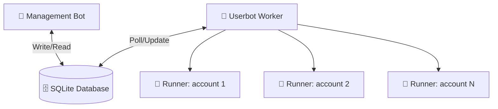
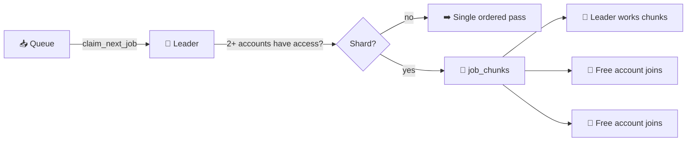

<div align="center">


**A production-ready Telegram content copier with a Hebrew management bot and a multi-account userbot worker.**

</div>

---

## 🏗️ Architecture

Two processes communicate exclusively through a shared SQLite database:

| Component | Library | Role |
|:---|:---|:---|
| 🤖 **Management bot** | `Telethon` (MTProto bot mode) | Hebrew UI, job creation, configuration |
| 👷 **Userbot worker** | `Telethon` (MTProto user mode) | Executes copy jobs, updates progress |

> [!IMPORTANT]
> SQLite is the only IPC channel. Neither process calls the other directly.

### 🔄 Data Flow


---

## 📋 Requirements

- 🐍 Python 3.11+
- 👤 One or more Telegram accounts (for the userbots)
- 🤖 A Telegram bot token (from [@BotFather](https://t.me/BotFather))
- 🔑 API credentials from [my.telegram.org](https://my.telegram.org/apps)

---

## ⚙️ Setup

### 1️⃣ Install dependencies

```bash
pip install -r requirements.txt
```

### 2️⃣ Configure environment

Copy `example.env` to `.env` and fill in all values:

```bash
cp example.env .env
```

Required fields:
- `BOT_TOKEN` — from @BotFather
- `TELETHON_API_ID` and `TELETHON_API_HASH` — from my.telegram.org
- `TELETHON_SESSION` — path for the session file (e.g. `sessions/userbot`)
- `ADMIN_IDS` — comma-separated Telegram user IDs allowed to use the bot

### 3️⃣ Authenticate the userbot session

This is a one-time step. It asks for your phone number and a confirmation code sent to Telegram.

```bash
python main.py setup
```

The `.env` account is registered automatically as the **default** userbot account on
first run. Further accounts are added from the bot UI — no `.env` changes needed.

### 4️⃣ Run

| Command | What it starts |
|:---|:---|
| `python main.py all` | Bot **and** worker in one process (simplest) |
| `python main.py bot` | Management bot only |
| `python main.py worker` | Userbot worker only |
| `python main.py setup` | One-time session authentication |

> [!NOTE]
> `bot` and `worker` can run as two separate processes instead. They coordinate through the database either way.

---

## 🎮 Usage

1. 🚀 Send `/start` to the management bot — a Hebrew control panel message appears
2. ➕ Add source and destination channels via the UI
3. 🤖 *(optional)* Add more userbot accounts: ⚙️ הגדרות → 🤖 חשבונות יוזרבוט
4. 📝 Create a job (choose copy mode and parameters)
5. 📤 Submit the job — the worker picks it up automatically
6. 📊 Monitor progress in the job detail screen (press Refresh)

---

## 📋 Copy Modes

| Mode | Description |
|:---|:---|
| ♾️ **All messages** | Copy every accessible message in the source |
| 📅 **Date range** | Copy messages between two dates (DD/MM/YYYY HH:MM, Israel local time) |
| 🔢 **ID range** | Copy messages between two numeric message IDs |
| 🎯 **Single message** | Copy one specific message by ID |
| 🔄 **Continuous** | Copy the history, then keep listening for new messages in real time |

---

## 🤖 Multi-Account & Parallel Copying

Every **active** userbot account gets its own runner: its own Telethon client, its
own copy engine, and its own claim loop. They all work at the same time.

### How work is shared



- **Across jobs** — two queued jobs and two accounts means each account takes a
  whole job of its own. This is always preferred: it is the fastest option *and*
  it preserves message order everywhere.
- **Within one job** — when there is nothing new left to claim, free accounts join
  a job already in progress. The account that claimed the job (its **leader**)
  checks how many active accounts can reach **both** of the job's channels:
  - **one** → a single ascending pass, exactly as a single-account install behaves
  - **two or more** → the source ID range is split into ~200 chunks (`job_chunks`),
    and every free account claims chunks of its own

Chunks are claimed atomically, so no two accounts ever touch the same message.
Throughput scales with the number of accounts — and so does the daily quota, since
Telegram enforces its limits **per account**.

> [!WARNING]
> **Order is the trade-off.** Within a chunk the order is the source's, but chunks
> are copied concurrently and therefore interleave in the destination. This is
> inherent to splitting one job across accounts. If strict source order matters,
> run the job while only one account can reach the channels.

### Per-account facts

- **Access is per account** — one account may be a member of a channel while another
  is not. Every account probes every channel for itself, and the channel detail
  screen reports exactly who can reach it.
- **The daily cap is per account** — an account that spends its quota simply stops
  claiming work while the others carry on. Only when *every* account is capped does
  the queue park until midnight (Israel time), and the admin is told.
- **Adding an account** clears every job's exclusion list — a new account may have
  access where the others didn't, so failed jobs get another chance.

---

## 📦 Content Types

- ✅ **Supported**: Text, photos, videos, documents/files (with captions), albums
- ❌ **Not supported**: Polls, games, invoices, live locations

Each job selects which of `text` / `image` / `video` / `file` to copy. Protected
("no forwarding") sources are detected automatically and fall back to
download-and-reupload.

---

## 🛡️ Blocked Words

Configure a list of blocked words in the bot UI. Any message containing a blocked word (in text or caption) is skipped entirely. No editing or partial removal — the whole message is skipped. The count of skipped messages is tracked per job.

---

## 🚑 Restart Recovery

The system is designed to survive process crashes:

- 🔄 **Worker crash mid-job**: On next startup, the worker detects that a job was `running` in the database and re-queues it as `pending`. Every account assignment and held chunk from the previous run is released.
- 📍 **Resume from checkpoint**: An unsharded job resumes from `jobs.last_processed_id`. A sharded job keeps a checkpoint **per chunk** (`job_chunks.last_processed_id`), so only the unfinished part of an interrupted chunk is redone — finished chunks are never revisited.
- 🫀 **Abandoned chunks**: A chunk whose owner has been silent for 30 minutes is handed back to the queue. The window is deliberately generous — reclaiming too early would let two accounts copy the same messages.
- 🛡️ **Duplicate prevention**: The `copied_messages` table tracks every processed source message ID. Messages already in this table are never re-sent, even if a checkpoint is stale.
- 🕒 **FloodWait handling**: If Telegram rate-limits an account, the job is moved to `waiting_retry` with a `next_retry_at` timestamp. On restart, the poll loop respects this timestamp. A flood wait on a *helper* account never stalls the job — the other accounts keep going.

---

## 🧱 Project Structure

```text
app/
├── 📄 config.py                  # ⚙️ environment config
├── 📄 db.py                      # 🗄️ SQLite connection, schema, migrations
├── 📄 models.py                  # 📦 typed dataclasses
├── 📄 network_errors.py          # 🔌 network-failure classification
├── 📂 repositories/              # 🗃️ Database operations (one file per entity)
│   ├── 📄 job_repo.py            # job lifecycle, additive progress, atomic claiming
│   ├── 📄 job_chunk_repo.py      # 🧩 chunk planning/claiming — parallel copying
│   ├── 📄 userbot_repo.py        # userbot accounts, sessions, default account
│   ├── 📄 channel_access_repo.py # per-account channel access results
│   ├── 📄 dedup_repo.py          # global transferred-content registry
│   ├── 📄 scan_repo.py           # duplicate scans and delete jobs
│   ├── 📄 source_repo.py         # sources and destinations
│   ├── 📄 filter_repo.py         # blocked words
│   ├── 📄 admin_repo.py
│   └── 📄 state_repo.py          # worker state, heartbeat, app_settings
├── 📂 services/                  # 🧠 Business logic
│   ├── 📄 job_service.py
│   ├── 📄 userbot_auth_service.py # interactive sign-in (phone→code→2FA)
│   ├── 📄 telegraph_service.py   # Telegraph reports for failed/skipped messages
│   └── 📄 validation_service.py
├── 📂 ui/                        # 🎨 Interface building
│   ├── 📄 texts.py               # 🇮🇱 all Hebrew strings
│   ├── 📄 keyboards.py
│   └── 📄 renderer.py
├── 📂 bot/                       # 🤖 Management Bot (Telethon MTProto)
│   ├── 📄 bot_main.py
│   ├── 📄 state.py
│   └── 📂 handlers/
└── 📂 worker/                    # 👷 Userbot Worker
    ├── 📄 worker_main.py         # 🚑 startup recovery, notifications, primary duties
    ├── 📄 userbot_manager.py     # 🤖 one runner per account, claiming, parallelism
    ├── 📄 copy_engine.py         # 🧠 Telethon copy logic + shard planning
    ├── 📄 scan_engine.py         # 🔍 duplicate scanning and bulk delete
    ├── 📄 rate_limiter.py        # ⏳ delays and batch pauses
    └── 📄 telegram_utils.py      # 🔗 entity resolution
📄 main.py                        # 🚀 entry point (all | bot | worker | setup)
```

---

## ⚠️ Safety Defaults

> [!TIP]
> All settings are adjustable via the Settings screen in the management bot.

- ⏱️ **Delay between messages**: 2.0–5.0 seconds (random; doubled after an album)
- 🧺 **Batch pause**: 60–120s after every 50–100 messages
- 🛡️ **FloodWait buffer**: 5–10 extra random seconds after the required wait
- 🔄 **Max retries**: 5 before a job is failed or paused
- 📅 **Daily limit**: 20,000 messages **per account** — capped accounts stop claiming; the queue only parks when every account is spent
- ⚡ **Concurrency**: one runner per active account, all working at once — across jobs by default, and within a single job once two or more accounts can reach its channels

---

<div align="center">

**Made with ❤️ by Omer**

</div>
